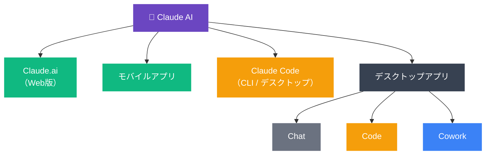
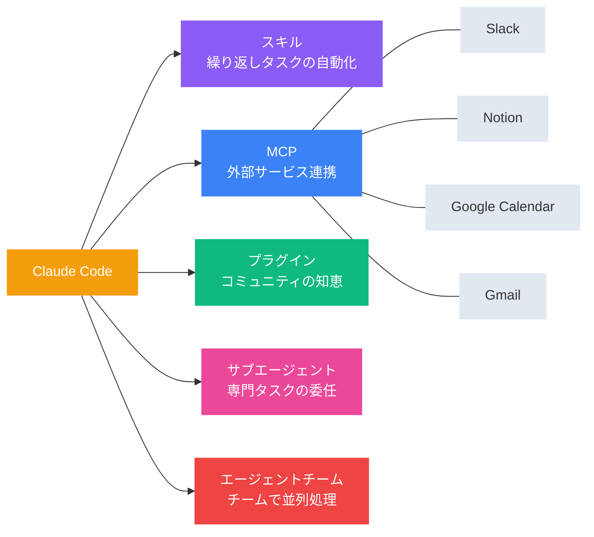
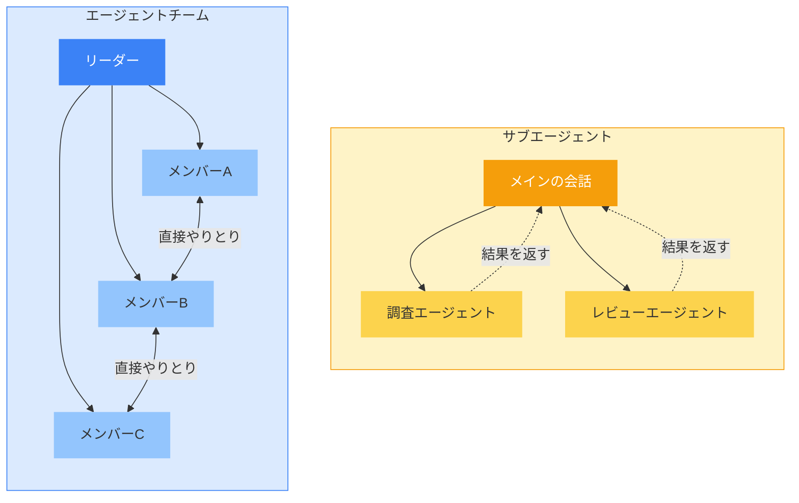

## AIは「質問に答える」から「タスクを実行する」へ

ChatGPTが登場してから約3年。当初は「AIに質問すると、それっぽい答えが返ってくる」という体験に驚いた方も多いのではないでしょうか。

しかし2026年の今、AIとの付き合い方は根本的に変わりつつあります。

**「聞けば教えてくれる」から「任せれば動いてくれる」へ。**

毎朝のニュースチェックをAIに任せて、要約をSlackに投稿してもらう。事業戦略の壁打ちを複数のAIに同時にやらせて、多角的な視点を得る。請求書の整理やコンテンツの下書きまで、指示を出せばAIが実行してくれる。自分自身、この半年でそんな働き方が当たり前になってきました。

その最前線にいるのが、Anthropicの「Claude」です。

Claudeはもはや単なるチャットボットではなく、用途に応じた5つのプロダクトを揃えたAIプラットフォームへと進化しています。本記事では、それぞれの特徴と使い分け、そしてClaudeの最も強力なモード「Claude Code」の活用法まで一気に解説していきます。

まずはClaudeの全体像をつかむところから始めていきましょう。

---

## Claudeプロダクト群の全体像

Claudeには現在、複数の「入口」があります。同じAIの頭脳にアクセスするのですが、それぞれインターフェースと得意領域が異なります。

それぞれ見ていきましょう。

### Claude.ai（Web版）

ブラウザを開けばすぐに使える、最も手軽な入口です。リサーチ、文書作成、データ分析、翻訳、ブレインストーミングなど、「考える系」のタスク全般に向いています。

アカウントさえあればデバイスを選ばないので、出先のPCからでもサッとアクセスできます。

### Claude モバイルアプリ

スマートフォン向けのアプリです。移動中にアイデアを整理したり、音声入力で壁打ち相手になってもらったり。

思いついたことをサッと投げて、後でデスクトップで続きを深掘りするような使い方が気に入っています。

### [Claude Code](https://code.claude.com/docs/ja)

Claudeの中で最もパワフルなプロダクトです。

ファイルシステム、ターミナル（シェル）、ブラウザにフルアクセスでき、PC上のあらゆる操作を代行する「AIエージェント」として動きます。コーディングはもちろん、ファイル操作、情報収集、外部サービス連携まで、できることに制限がほぼありません。

さらにスキル、サブエージェント、エージェントチーム、MCP、プラグインといった拡張機能もすべて利用可能で、Claudeの全機能をフルに引き出せます。何度触っても「ここまでできるのか」と驚かされます。

Claude Codeにはターミナルから起動するCLI版と、後述するデスクトップアプリのCodeモードの2つがあり、機能は同等です。ターミナル操作に慣れた方はCLI版の方がスピーディーですし、GUIが好みならデスクトップアプリから使えます。

### Claude デスクトップアプリ（Chat / Code / Cowork）

macOS・Windows向けのデスクトップアプリには、3つのモードがあります。

- **Chat**: Web版と同様の対話モード。日常のちょっとした質問や相談に。
- **Code**: 上で紹介したClaude CodeをデスクトップアプリのGUIから利用できるモードです。ターミナル版と同等の機能を持ち、ファイル操作・シェル実行・拡張機能のすべてが使えます。
- **Cowork**: Claude Codeのエージェント能力を、ターミナルを一切触らずに使えるモードです。ローカルファイルの読み書きや、複雑なタスクの自律実行ができます。サブエージェントやエージェントチームなど一部Claude Code専用の機能はありますが、日常のタスクで困ることはほぼありません。

つまり、デスクトップアプリのCoworkとCodeは「Claude Codeの便利さを、ターミナル抜きで体験できるモード」です。日常の業務タスクならCoworkで十分ですし、もっと深い自動化や開発に踏み込みたくなったらClaude Codeに切り替える、という使い方がおすすめです。

### シーン別おすすめプロダクト

| やりたいこと                   | おすすめ             |
| ------------------------------ | -------------------- |
| ちょっとした質問・翻訳・要約   | Web版 / Chat         |
| 移動中のアイデア整理           | モバイルアプリ       |
| 資料作成・レポート・企画立案   | Chat / Cowork        |
| ファイル操作・自動化・外部連携 | Cowork / Claude Code |
| コーディング・システム開発     | Claude Code          |

---

## Claude Codeを使うための前提知識

ChatやCoworkは直感的に使えますが、Claude Codeのパワーを引き出すにはいくつかの基本概念を押さえておくと、指示の精度がグッと上がります。

エンジニアでない方にも分かるように、ひとつずつ見ていきましょう。

### ターミナルとは？

ターミナルは、PCに「文字で指示を出す」ための窓口です。

普段はマウスでフォルダをダブルクリックして開いたり、ファイルをドラッグして移動したりすると思います。ターミナルでは、これと同じ操作を文字（コマンド）で行います。

なぜわざわざ文字で？　文字の方が「正確に」「大量に」「繰り返し」指示を出せるからです。Claude Codeはこのターミナルの仕組みを通じて、PC上でさまざまな操作を実行してくれます。

### コマンドとは？

「このフォルダの中身を見せて」「新しいファイルを作って」「この内容をSlackに送って」……こうした指示をテキストの短い命令文にしたものがコマンドです。

例えば `ls` と打てばフォルダの中身が一覧表示され、`mkdir reports` と打てば「reports」というフォルダが作られます。

とはいえ、Claude Codeを使う場合にコマンドの詳細を覚える必要はありません。「reportsフォルダを作って」と日本語で伝えれば、Claudeが適切なコマンドに変換して実行してくれます。「ターミナルではコマンドで操作する」という概念だけ知っておけば、Claudeが何をしているのか理解しやすくなります。

### ディレクトリ（フォルダ）構造

PCの中身は「フォルダの入れ子」で構成されています。デスクトップもダウンロードフォルダも、すべてこの階層構造の一部です。

ターミナルは常に「どこかのフォルダ」にいます。Claude Codeを起動するとき、どのフォルダで起動するかが重要なポイントです。プロジェクトのフォルダで起動すれば、Claudeはそのプロジェクトの全ファイルを把握した上で作業してくれます。

### Gitとは？

Gitは、ファイルの変更履歴を記録する仕組みです。イメージとしてはWordの「変更履歴の記録」やGoogleドキュメントの「版の履歴」に近いですが、もっと強力です。

いつ、誰が、どのファイルのどこを変えたかを全て記録し、いつでも過去の状態に戻せます。Claude Codeはファイルを直接編集するので、Gitで管理しておくと「万が一AIが意図しない変更をしても、すぐ元に戻せる」という安心感があります。

**ポイント:** これらの概念を完璧に理解する必要はありません。Claude Code自身がファイル操作もGit管理も行ってくれます。ただ「Claudeがいま何をしているのか」が分かると、より的確な指示を出せるようになるので、ざっくり把握しておくだけで十分です。

---

## Claude Codeで何ができるのか — 開発だけじゃない

「Code」という名前から、プログラミング専用ツールだと思われがちですが、実際にはもっと広い用途で活躍します。

Claude Codeの本質は **「PCの操作権限を持ったAIエージェント」** です。

### 具体的にできること

- **情報収集と分析**: Webから最新トレンドを収集し、分析してレポートにまとめる
- **文書作成**: 記事の下書き、提案書、議事録の作成
- **外部サービス連携**: Slackへの投稿、Googleカレンダーの確認、Notionへの書き込み
- **ファイル管理**: フォルダの整理、CSVデータの加工、PDFの内容抽出
- **定型業務の自動化**: 毎朝のルーティンワーク、請求書の整理、データの集計

自分の場合、開発はもちろん、毎日のトレンド収集からSlack投稿、記事の下書き作成まで、かなりの業務をClaude Codeに任せています。一度仕組みを作ってしまえば、あとはワンコマンドで回せるようになるので、本当に楽になりました。

### [CLAUDE.md](https://code.claude.com/docs/ja/memory)で「自分専用のAIパートナー」に育て上げる

Claude Codeで重要なのが、**CLAUDE.md** というファイルです。

プロジェクトフォルダに置くテキストファイルで、いわばClaudeへの「取扱説明書」のような役割を果たします。例えば、こんなことを書いておけます：

- あなたの役割や事業の概要
- よく使うツールやサービスの情報
- 作業の進め方のルール（「推測で進めず、不明点は確認して」など）
- フォルダ構造の説明

一度書いておけば、Claude Codeは毎回この文脈を踏まえた上で動いてくれます。使い込むほど、自分の仕事を理解した「専属アシスタント」に育っていく感覚があるんですよね。CLAUDE.mdの設計次第で体験が大きく変わるので、ここは丁寧に作り込む価値があります。

---

## Claude Codeの拡張エコシステム

Claude Codeは単体でも強力ですが、拡張機能を組み合わせるとさらに多くのことが可能になります。

イメージとしては「AI開発におけるUSB-Cポート」のようなもので、さまざまなツールやサービスとつなげられる仕組みが整っています。

### [スキル（Skills）](https://code.claude.com/docs/ja/skills)

繰り返し行うタスクをワンコマンドで実行できるようにする仕組みです。

例えば「トレンド収集」「記事の下書き作成」「戦略分析」といった一連の作業手順をスキルとして定義しておけば、毎回ゼロから指示を出す必要がなくなります。自分で作ることもできますし、コミュニティが公開しているスキルを導入することもできます。

よく使うワークフローがある方は、まずスキル化してみるのがおすすめです。

### [MCP（Model Context Protocol）](https://code.claude.com/docs/ja/mcp)

Slack、Google Calendar、Notion、Gmailなど、外部サービスとClaudeをつなぐ仕組みです。MCPを設定すると、Claudeが直接これらのサービスを操作できるようになります。

「今日の予定を確認して」「このレポートをSlackの#generalに投稿して」といった指示が、Claude Code上で完結します。

自分もSlackやNotionやGoogleカレンダーを連携していますが、外部サービスがClaudeから直接動くのは毎回新鮮な体験です。

### [プラグイン & マーケットプレイス](https://code.claude.com/docs/ja/discover-plugins)

スキルやMCPサーバー、Hooksなどをパッケージ化したものがプラグインです。マーケットプレイスからワンコマンドでインストールでき、他の人が作った便利な機能を手軽に取り込めます。

Anthropic公式のマーケットプレイスでは、営業、マーケティング、財務、カスタマーサポートといった職種別のプラグインが提供されています。プラグインをインストールするだけで、汎用AIが営業の専門家や財務アナリストのように振る舞ってくれるイメージです。もちろん開発向けのプラグイン（GitHub連携、Figma連携など）も充実しています。

2026年に入ってエコシステムが急速に充実してきていて、既存のプラグインを活用しつつ、足りないものは自分で作っていく。そんなサイクルが回り始めています。

### [サブエージェント（Sub-agents）](https://code.claude.com/docs/ja/sub-agents)

Claude Codeの中から、特定のタスクに特化した「部下」を呼び出す仕組みです。

メインの会話とは別のコンテキストで動くので、大量の調査結果や長い処理ログでメインの会話が埋まることがありません。例えば「このプロジェクトの構造を調べて」と指示すると、Claudeは自動的にExploreというサブエージェントに調査を委任し、結果だけを受け取ります。

ビルトインのサブエージェント（Explore、Plan、汎用エージェント）が最初から用意されているほか、自分専用のサブエージェントを作ることもできます。「コードレビュー担当」「データ分析担当」「デバッグ担当」のように用途に応じた専門エージェントを定義しておくと、Claudeが状況に応じて適切なものを自動で選んで使ってくれます。

使用するAIモデルやアクセスできるツールもサブエージェントごとに制限でき、安全性とコストの両方をコントロールできます。

### [エージェントチーム（Agent Teams）](https://code.claude.com/docs/ja/agent-teams)

複数のClaude Codeインスタンスが「チーム」として連携する仕組みです。リーダーがタスクを分割し、チームメイトに並列で作業させ、結果を統合します。

例えば、複数のニュースソースから情報を同時に収集して一つのレポートにまとめたり、セキュリティ・パフォーマンス・テストカバレッジをそれぞれ別のメンバーが同時にレビューしたり。一人のAIでは時間がかかるタスクも、チームで動かせば大幅に効率化できます。

### サブエージェントとエージェントチームの使い分け

どちらも「作業を分担する」仕組みですが、根本的な違いがあります。

|                        | サブエージェント                   | エージェントチーム                       |
| ---------------------- | ---------------------------------- | ---------------------------------------- |
| **構造**               | メインの会話の中で部下が動く       | 独立した複数セッションが協調する         |
| **コミュニケーション** | 結果をメインに返すだけ             | メンバー同士が直接やりとりできる         |
| **向いている場面**     | 調査・検証など、結果だけ欲しい作業 | 議論・相互レビューなど、協調が必要な作業 |
| **コスト**             | 低め（結果を要約して返す）         | 高め（各メンバーが独立したセッション）   |

ざっくり言えば、**サブエージェントは「ちょっと調べてきて」の部下**、**エージェントチームは「みんなで一緒にやろう」のプロジェクトチーム**です。

まずはサブエージェントから使い始めて、より複雑なタスクが出てきたらエージェントチームを検討する、という流れが自然だと思います。

---

## まとめ

ということで、Claudeのプロダクト群とClaude Codeの拡張エコシステムを一通り見てきました。

Claudeは「チャットで質問するAI」から、「仕事もプライベートもまるごと任せられる汎用的なAIエージェント」へと進化しています。

実際この1年で仕事の進め方が根本から変わりました。そしてこの変化は、今AIを使いこなしている人とそうでない人の間で、大きな格差になりつつあります。

大事なのは、目の前の仕事をいかにワークフローとして落とし込み、AIに任せていけるかを考え抜くこと。思考停止して惰性で自分の手を動かしていては、この流れに取り残されてしまうと感じています。

どこから始めるかは、皆さんの目的次第です。

- **まず気軽に試したい** → Web版やデスクトップ版のChatで対話してみる
- **プロジェクト単位で業務を任せたい** → Coworkでファイルと指示をまとめて渡す
- **自動化や外部連携まで踏み込みたい** → Claude Codeを起動して、小さなタスクから任せてみる

そしてどのモードを使うにしても、最初にやるべきことはひとつ。**CLAUDE.mdを書くこと**です。自分が何者で、何を目指していて、どんなルールで働いてほしいか。それをAIとの対話を通してカジュアルに伝えるだけで、Claudeの振る舞いが劇的に変わります。

小さなタスクから始めて、日々コンテキストを積み重ねていく。その積み重ねが、想像以上に大きな武器になります。

今回は抽象的な話が多くなりましたが、次回の実践編では、具体的なセットアップ手順や実際のワークフロー構築について解説していきます。お楽しみに！
